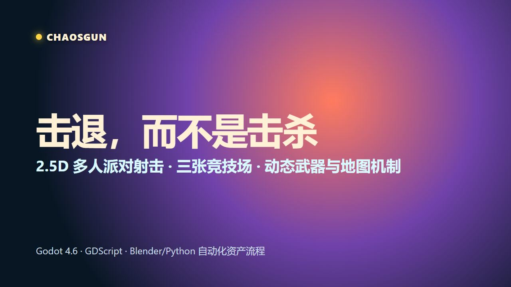
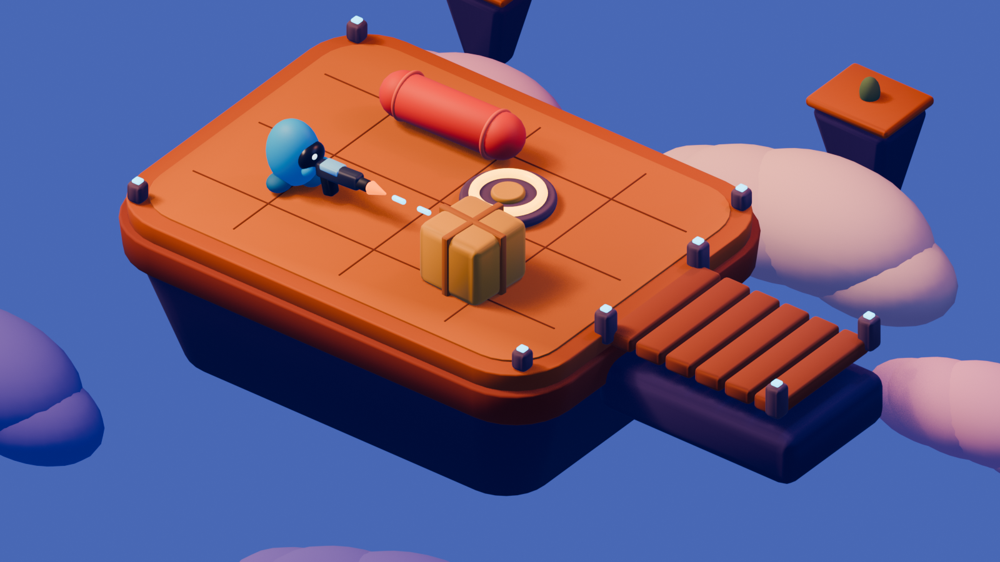
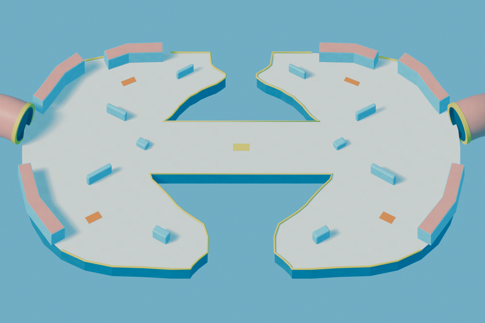

# ChaosGun

> 2.5D 击退射击对战游戏原型：用枪的击退力把对手打下平台。

## Demo 视频

[](media/demo/ChaosGun_Demo_Final.mp4)

**[▶ 点击观看 45 秒完整 Demo（有声）](media/demo/ChaosGun_Demo_Final.mp4)**

视频展示三张竞技场、核心击退玩法，以及动态武器与地图机制。

## 面试官快速入口

打开仓库后，建议按这个顺序查看：

1. 先观看上方 45 秒 Demo，快速了解核心玩法与最终视觉方向。
2. 阅读 [作品集演示指南](docs/portfolio/demo-guide.md)，其中列出了推荐场景、操作方式和验证结果。
3. 用 Godot 4.6 打开 `project.godot`，按 F6 运行推荐演示场景；也可以直接运行主场景后从菜单进入地图。
4. 查看 `scenes/`、`scripts/` 和 `tools/`，了解场景、玩法系统与自动化资产/验证流程。

## 作品展示

### 主力可玩竞技场切片



### Twin Bays：视觉与关卡制作切片



更多截图、对比稿和制作决策见 [`docs/art-direction/`](docs/art-direction/) 与 [`docs/ui/`](docs/ui/)。

## 核心玩法

- **击退为王**：武器主要通过击退而非传统 HP 伤害取胜。
- **多武器对战**：手枪、SMG、AK 步枪、狙击枪拥有不同射速、后坐力、散布和击退参数。
- **多人 + AI**：支持本地多人、AI 对手、目标选择和多种瞄准/操控模式。
- **竞技场机制**：边缘掉落、复活无敌、传送门、风场、潮汐/水体与环境动效。
- **可验证工作流**：脚本化截图、结构审计、性能测试和发布前验证均位于 `scripts/tests/`。

## 技术栈

| 项目 | 技术 |
| --- | --- |
| 引擎 | Godot 4.6 |
| 语言 | GDScript |
| 渲染 | Forward+ / gl_compatibility |
| 视角 | 2.5D 正交投影 |
| 资产流程 | Blender + Python/PowerShell 构建脚本 |

## 如何运行

1. 安装 [Godot 4.6](https://godotengine.org/download)。
2. 克隆仓库并在 Godot 中导入 `project.godot`。
3. 运行主场景，或按 [作品集演示指南](docs/portfolio/demo-guide.md) 选择推荐场景。
4. 自动化验证优先使用 headless 模式；任何可见测试窗口均保持普通窗口、非全屏、最大 960×540。

基础操作：W/A/S/D 移动，鼠标瞄准，鼠标左键射击，1/2 或滚轮切换武器。

## 项目结构

```text
scenes/       Godot 场景与 UI
scripts/      玩家、AI、武器、地图和验证脚本
assets/       Blender 源文件、生成模型、材质和音频
tools/        资产构建、重建、对比与审计工具
docs/         视觉契约、演示指南、验证证据和工作流文档
resources/    地图、UI 与验证配置
```

## 验证与开发记录

- `docs/portfolio/demo-guide.md`：面试展示顺序与运行说明。
- `docs/workflow/chaosgun-demo-production-playbook.md`：从概念到可玩切片的全自动制作流程。
- `scripts/tests/`：运行时、结构、性能和截图验证器。
- `AGENTS.md`：Godot 测试窗口安全规则。

## License

当前为个人作品集与面试演示项目。
