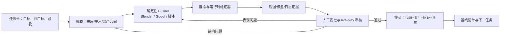

# ChaosGun 全自动游戏开发工作流：项目记忆与复盘

**记录日期：2026-07-13**  
**证据范围：Git 提交历史、仓库内脚本/场景/评审文档/验证日志。**  
**可信度约定：**本文件只把仓库可验证的内容写成事实；没有保存在仓库中的对话、人工判断和工具会话，不会伪装成已知事实。它们统一列入“待补证”。

## 0. 为什么要保存这份记忆

ChaosGun 的价值不只是当前原型，而是一次“人定义目标，自动化系统持续制作、验证并留下证据”的实践。过去的上下文会被压缩，临时终端输出会消失，视觉判断也容易只留在人的记忆里；如果不把决策、资产、验证和失败原因绑定到版本库，后续自动化只能重复试错。

本文件是之后所有自动做游戏项目的起始记忆：先读它，再读当前任务卡、规格和最近一次验证报告；不要靠聊天记录猜历史。

## 1. 产品与技术基线

- **产品：**四人、本地多人、2.5D/固定等距视角的竞技射击原型；核心胜负不是传统血量清空，而是以武器击退将对手打出平台。
- **主引擎：**Godot 4.6、GDScript、Forward+/`gl_compatibility`；项目入口为 `project.godot`，运行内容主要在 `scenes/`、`scripts/`、`resources/`。
- **核心循环：**移动/瞄准 → 不同武器的击退、后坐、射速和散布 → 抢武器 → 在桥、边缘和中心制造 ring-out → 死亡、重生、短暂无敌、重置为手枪。
- **武器族：**Pistol、SMG、AK Rifle、Sniper；运行时武器逻辑、投射物、拾取与刷新分离在 `scripts/weapons/`。
- **角色与 AI：**共享 `BaseCharacter` 的生命、击退、坠落、死亡/重生机制；玩家、FSM AI、Dummy 各自保留输入或行为差异。
- **并行迁移实验：**`unity_migration/` 是一个可玩的 Unity 首轮迁移，不是 Godot 主线的替代。它已有 ring-out、四种枪、AI、HUD、重生和临时无敌；尚未迁移 Godot 场景/美术、完整 UI、音频、武器刷新与细化反馈。

## 2. 已证实的开发历程

### 2.1 2026-04：先建立“能打”的核心

提交记录表明，原型先后建立了：

1. 标准输入与角色基础类，随后将物理重构为“输入速度 + 动量”的组合，而非击退时完全夺走控制权。
2. 本地多人、菜单、选角、键位、暂停、HUD；这是测试真实多人体验的必要底座。
3. 武器、AI、生命/复活、击杀归属、结算、音效、地图与地图选择。
4. 以 `GameConfig` 集中运行时常量，并把 Player、AI、Dummy 的共性抽到 `BaseCharacter`，避免三个角色逐渐长成不一致的系统。
5. 命中停顿、屏幕震动、Squash & Stretch、击退累积等手感增强；视觉反馈发展为枪口火、弹道、命中、受击闪白等可组合效果。

**可复用结论：**先让“移动、射击、击退、坠落、重生”形成闭环，再扩展地图和视觉。自动化可以快速堆功能，但共享物理与配置必须尽早集中，否则后续调参和迁移成本会指数增长。

### 2.2 2026-04 下旬：把“感觉”从主观变成可比较数据

项目形成了 `resources/feel_profiles/*.json` 和 `scripts/tests/` 中的 probe/batch/scorer 流程。它记录并比较：持有主武器的 AI 数、死亡数、疑似 ring-out、同时存在的拾取物/拾取簇、首次死亡时间和随机种子。

- 相同 run index 让各 profile 使用相同 seed，降低比较噪声。
- 评分故意惩罚死亡为零、首死过慢、范围过大的不稳定样本，而不是追逐单次最高分。
- 任何看似优秀的单次结果都必须进入多轮 batch；AI 拾取目标的若干尝试在确定性检查中看似可行，却未改善 batch 指标，因此没有保留。

**可复用结论：**自动化测试要衡量“稳定的方向”，而非宣称“机器人已证明好玩”。节奏、桥上压力和真实操控仍必须用 live play checklist 由人确认。

### 2.3 2026-07-09 至 07-10：Open Ring-Out A1 的可验证美术生产

这一阶段不是直接装饰场景，而是按以下顺序推进：

1. 定义 A1 美术升级设计、中文说明与实施计划。
2. 建立 Blender 美术 gate、headless runner、截图捕获和固定视觉锚点。
3. 重做岛屿 shell、桥梁、边缘和表面；再补深度与道具构图。
4. 让截图 gate 可复现，针对评审暴露的问题继续修正，并记录艺术评审。
5. 当 Blender 构建失败时，验证脚本必须向上游传播失败，而不能产出“看似通过”的旧截图。
6. 提交可玩的 demo baseline，并明确区分可复现内容、临时日志、探索状态和独立 Unity 实验。

**关键成果：**环境不是一次性手工产物，而是由 Blender builder、Godot 场景、验证器、截图证据和评审文档共同构成的可回归资产链。

### 2.4 2026-07-10 至 07-11：从概念合同到运行时整合

确定的 V2 方向是 **Sunset Toy Sky Islands（暖光玩具天空岛）**。它保持既有竞技拓扑（中央岛、四侧岛、四桥、固定相机、ring-out 边缘和拾取位置），但用温暖圆润的岛层、木桥、紫色悬崖、云层、稀疏故事书道具和明确的红/青/金色语义建立产品感。

重要约束：

- 概念图只能约束色彩、比例、材质和构图；不能复制任何商业游戏的角色、UI、道具或辨识性资产。
- 美术不得通过改变桥、岛、墙或路线去掩盖玩法问题。
- 中心拾取是环境焦点，活跃射击/命中是动作焦点；中央战斗地面保持开阔，道具集中到侧岛和边缘。
- 用大面材质和清晰轮廓优先于噪声细节、泛滥 bloom 或随机粒子。

环境经历了 hero slice、中央平台整合、拾取标记清理、运行时岛屿几何、中央生产 pass、全图统一、氛围/地标、悬崖表面、桥接结构与出生/拾取节奏修正，最终环境 closure 评审为 **28/35**：运行时安全 5/5，概念最终匹配仍 HOLD。已知缺口是柔和云资产、少量高质量地标变体和角色材质整合后的色彩分级。

### 2.5 2026-07-11 至 07-12：角色、武器、动作反馈与 AI 辅助建模

角色/武器生产采用了明确的混合模式：

1. 干净的中性参考图定义轮廓和比例。
2. TripoSR 的本地重建只用作体块参考，不作为可发货网格。
3. Blender 生成干净、命名明确、可拆分的生产角色。
4. Godot 根据武器切换手枪与长枪姿势集。

运行时资产合同要求身体、头盔/领口/面部/面罩、腿、靴子、手臂和手套是独立部件；武器独立 GLB；每把枪有 holder 和 muzzle anchor；武器不能穿到躯干深度平面后方。随后完成或迭代了：

- 玩具枪和角色的可读性展示、每种枪的握持姿势、全身动作反馈。
- 干净的枪口/投射物/命中效果，以及 0.12s 受击脉冲、方向受击斩、0.24s ring-out、0.30s respawn 的短时反馈预算。
- 重生时半透明青色护盾，取代整角色闪烁；所有瞬态节点自行销毁且不投地面脏阴影。
- 武器刷新展示、主场景道具、锁定提示位置。
- 角色从 Blender 重建到 AI 引导姿势、关节化武器姿势，以及 V2 hero 的轮廓、头盔、躯干壳体、连接与衣领褶皱连续修正。

**可复用结论：**AI 生成/重建适合提供体块、姿态和概念候选，生产资产仍要以可命名、可拆、可挂点、可导出的建模合同为中心。一次“看上去像”的融合网格无法支撑握枪、动画、材质和运行时替换。

## 3. 已验证的自动化工作流



### 3.1 每次迭代的最小交付包

对地图或有意义的垂直切片，必须同时更新：

1. **任务卡：**本 pass 要解决什么、明确不做什么、成功条件和检查方式。
2. **规格：**目标体验、布局/比例、禁止模式、资产/镜头/视觉约束。
3. **验证清单：**连通性、坠落风险、出生与节奏、可读性、战斗价值、资源刷新。
4. **需要手感或展示时的 live-play checklist：**开局节奏、路线价值、ring-out、拾取压力、出生安全。
5. **可执行验证器与证据：**headless 检查、批量 smoke、截图或模型预览；验证失败必须非零退出并阻断通过。
6. **评审记录：**做了什么、评分/通过标准、证据路径、未解决问题和下一优先级。

### 3.2 阶段门（不能跳过）

| 阶段 | 可改内容 | 放行条件 | 失败时回退 |
| --- | --- | --- | --- |
| 目标定义 | 任务与验收 | 目标、非目标、成功与检查明确 | 不开始实现 |
| Whitebox | 岛、桥、间隙、出生、刷新、路线 | 连通、真实 ring-out、双出口出生、刷新点有效、无 bunker、纯布局已好玩 | 布局/节奏问题 |
| Graybox | 轻掩体、地标、镜头、可读性 | 中心/侧翼/桥/危险区可快速读懂 | 结构可读性问题 |
| Dressing | 道具、边界、灯光、材质 | 不伤路线与危险表达，桥口和出生出口清晰 | 道具遮挡/氛围失序 |
| Polish | 精细镜头、VFX、材质、展示 | checklist、live-play 准备、有效/遗留/下一步均已记录 | 不可用来掩盖前序缺陷 |

### 3.3 现有验证资产如何使用

- `scripts/tests/` 包含地图白盒、AI smoke、镜头锁定、拾取、按住开火、投射物/轨迹、角色与武器可读性、战斗反馈、Blender 视觉和截图验证器。
- `tools/` 包含可重复执行的 Blender builder、预览渲染和纹理生成脚本；builder 的输入与输出应写入评审记录。
- `reports/` 存放截图和报告证据；根目录 stdout/stderr 是临时运行记录，默认不应作为基线提交物。
- `docs/workflow/chaosgun-v2-baseline-manifest-2026-07-10.md` 定义了可复现 Demo 所需内容与应排除的日志/会话状态。

## 4. 已得到的工程与产品教训

1. **不要让视觉修改暗改玩法。**碰撞、路线与视觉 shell 分离；装饰层应可被验证为无碰撞。任何桥/边/出生变化必须重新跑 gameplay smoke。
2. **截图是必要证据，不是唯一证据。**截图可审美，headless verifier 可防回归，batch smoke 可看趋势，live play 才能确认人手感；四者不可互相替代。
3. **固定镜头必须被当作合同测试。**一个应固定的竞技镜头若被运行时跟随、重置或旋转，视觉设计和截图结论都会失效。
4. **每个美术目标都应有可数的锚点。**例如桥口、岛边、材质数量、场景节点、相机状态、GLB 挂点；不要只写“更精致”。
5. **失败应在最早环节传播。**构建 Blender 失败、使用旧缓存截图、只验证节点存在而不验证运行时效果，都会制造虚假的绿灯。
6. **先锁“概念合同”，再批量生产。**颜色、形状、拓扑不变量、镜头、焦点、禁忌和验收顺序应先写成文档；否则自动生成会迅速偏离同一产品。
7. **资产来源与可发货性要分开。**AI 重建、参考图、临时生成图可以服务判断；真正运行时资产必须有可追踪的源、命名、部件和确定性导出。
8. **在提交中保存“为什么”。**提交只保存“什么变了”仍不够；评审文档需要保存评分、失败原因、证据和下一步，才让未来 agent 能正确续做。

## 5. 记忆保存协议（今后强制执行）

### 5.1 每个自动化 pass 结束时写入 Memory Capsule

在 `docs/workflow/memory/` 下新增或更新 `YYYY-MM-DD-<slice>-memory.md`，至少包含：

```md
# <pass 名称> memory capsule
- 决策：批准了什么；拒绝了什么；为何如此。
- 不变量：不能被后续自动化改变的玩法/镜头/资产合同。
- 输入：参考、提示词、源资产、工具版本、随机 seed。
- 产物：源文件、导出文件、场景节点、提交 SHA。
- 验证：执行命令、结果、截图/报告路径、人工评审结论。
- 失败与废案：尝试了什么、为什么没有保留。
- 风险与待办：事实、假设、下一步；不要把猜测写成事实。
```

### 5.2 提交与基线规则

- 一个提交只表达一个可审查意图；提交信息说明结果，capsule 说明原因和证据。
- 每次进入新阶段，创建/更新 baseline manifest，明确可复现文件、刻意排除项、验证命令和通过标准。
- 不提交 root 日志、字节码、会话缓存和未审查的大型中间产物；但必须保留能重建发货资产的 builder、输入版本和导出合同。
- 当上下文压缩或新 agent 接手时，按“本文件 → 最新 capsule → 当前任务卡/规格 → 最近验证 → `git log`/`git status`”恢复状态。

### 5.3 待补证标记

- 使用 `事实`、`推断`、`待确认` 三种标签；不允许无标签的回忆性结论。
- 重要人工决策若只存在聊天中，必须在下一个提交前补写 capsule，并附上对应提交或报告路径。
- 文档若出现乱码/错误编码，不能再作为唯一记忆源；应以 UTF-8 重写或从 Git 原始内容恢复，再标记替换时间。本次盘点已发现 `README.md` 与 `walkthrough.md` 的当前显示存在编码异常，需单独修复。

## 6. 当前状态与下一步

### 事实

- 当前本地分支为 `codex/art-vertical-slice-v2`，相对 `origin/codex/art-vertical-slice-v2` **领先 12 个提交**（检查时间：2026-07-13）。这些提交包含角色/武器姿势和 V2 hero 建模的最新演进，尚未包含在此前创建的 PR #1 中的远端分支状态。
- 工作区还有未跟踪的角色参考与 AI 重建输入：`assets/source/characters/ai_reconstruction_v2/`、`assets/source/characters/reference/character_turnaround_v1.png`、`assets/source/characters/reference/turnaround_v1_views/`。它们可能是当前 hero v2 的重要来源，但尚未被纳入可复现提交；在确认来源、许可和是否需要版本化前，不应静默删除或自动提交。
- 环境 closure 已支持角色/武器/战斗反馈的垂直切片，但最终概念匹配仍为 HOLD；角色完成度应在最终环境光照中审查，而不是只在隔离建模场景中判断。

### 建议的下一张任务卡

**“Hero character V2 acceptance and export contract”**：在固定的 Sunset Toy Sky Islands 游戏镜头中，验证 hero V2 的轮廓、武器握持、接触阴影、四种武器切换、GLB 导出和性能；产出截图证据、运行时 verifier、源资产清单和 memory capsule。不要同时改环境拓扑、武器数值或 HUD。

## 7. 本次复盘的证据索引

- 项目/核心玩法：`README.md`、`scripts/player/base_character.gd`、`scripts/weapons/`、早期 2026-04 Git 提交。
- 分阶段生产规则：`docs/workflow/workflow-overview.md`、`docs/workflow/stage-gates.md`。
- 手感与统计：`docs/workflow/chaosgun-feel-tuning-loop.md`、`resources/feel_profiles/`、`scripts/tests/feel_tuning_*`。
- 环境方向与边界：`docs/art-direction/chaosgun-visual-slice-v2-contract.md`。
- 环境状态：`docs/art-direction/sunset-open-ringout-environment-closure-p8-review.md` 及相邻 P1–P7、V2 review。
- 角色生产：`docs/art-direction/character-ai-guided-production.md` 及角色/武器/战斗反馈 review。
- 可复现边界：`docs/workflow/chaosgun-v2-baseline-manifest-2026-07-10.md`。
- Unity 实验：`unity_migration/Assets/ChaosGun/MIGRATION_NOTES.md`。
- 完整时间线：`git log --all --date=iso-strict`；本文件截至 2026-07-13 的可见提交记录。

