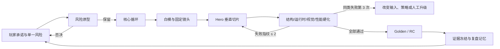

# ChaosGun Godot Demo 可复制稳定工作流手册

> **版本**：1.0  
> **状态**：维护中的唯一内容真源  
> **证据截止**：2026-07-23  
> **仓库审计点**：`d280e7c26abe9537975caf875357befae783b012`  
> **冻结展示基线**：`chaosgun-demo-main-v1` → `0cbe9c4fe2d2d875b31282a364fc239fe58fa2e5`  
> **后续 RC 工程锚点**：`0f75645`  
> **适用范围**：ChaosGun Godot 仓库、当前工作区及明确属于 ChaosGun Godot 的 Codex 任务；不含 Unity 前身  
> **维护原则**：Markdown 是唯一内容真源；DOCX 只能由 `tools/build_chaosgun_demo_playbook_docx.py` 再生

## 阅读约定与可信度标签

这不是“凭记忆写出的经验文章”，而是可追溯的操作手册。每个重要判断使用以下标签：

- **[事实]**：可由提交、文件、报告、截图或任务记录直接复核。
- **[推断]**：由多项事实归纳，可能随项目阶段变化。
- **[建议]**：面向下一次 Demo 的工程选择，不冒充已经实施。
- **[厂商声明]**：来自工具官方文档或官方仓库，不等于 ChaosGun 已实测。

证据编号采用 `E-xxx`。本手册正文引用的证据在“附录 E：证据索引”中给出路径或来源；覆盖数量、去重结果和未读原因在“附录 D：覆盖台账”中单独列出。

---

# 1. 一页生产控制台

## 1.1 项目承诺

**[事实｜E-001、E-011]** ChaosGun 的核心不是“做出更多资产”，而是让 1–4 名玩家在俯视派对射击场景中，通过可读的武器角色、持续累积的击退、坠落与快速复活，形成短周期、强反馈、可复盘的混乱对抗。

下一次 Demo 的最短承诺应写成一句可验证的话：

> 玩家在 60 秒内能理解移动、瞄准、射击、击退与坠落；在 3 分钟内至少经历一次“预判—命中—高击退—环出—反击”的完整情绪弧。

如果一个新增系统不能增强这条弧线、降低理解成本或减少生产返工，就不应优先进入 Demo。

## 1.2 三条基线必须分开

| 名称 | 固定点 | 能说什么 | 不能说什么 |
|---|---|---|---|
| 冻结展示基线 | `chaosgun-demo-main-v1` / `0cbe9c4` | 已被固定、可回到同一展示状态 | 不能代表 Twin Bays 或后续 P31/P32/P33 工作 |
| RC 工程锚点 | `0f75645` | 后续性能预算与 RC 工程流程的参考点 | 不能覆盖它之后的新改动 |
| 当前实验工作区 | `d280e7c` 加 47 个修改、112 个未跟踪项（审计时） | 可作为进行中证据 | 不能叫稳定版、Golden 或发布通过 |

**[事实｜E-002、E-003、E-020]** 最新 Twin Bays 全量发布尝试 `20260723T133159540Z-pid83688` 的结构、运行时和 AI 批量门禁大多通过，但性能门禁失败：平均约 150.30 FPS，1% low 约 20.22，低于 55；同时证据记录出现 960×540 与“生产必须原生 1920×1080”的口径冲突。因此本手册把 Twin Bays/Momentum Circuit 标记为“进行中证据”，绝不提升为稳定最佳实践。

## 1.3 最短执行路径

1. 写一页“玩家承诺 + 单一最大风险 + 不做清单”。
2. 先做 15–30 分钟可判死刑的风险原型，不做美术。
3. 只保留能产生目标情绪弧的核心循环；固定一组种子和探针。
4. 用白模证明空间拓扑、镜头和碰撞；用固定机位截图做第一次人审。
5. 只选择一个 Hero 切片升级到可展示质量；其余区域保持白模或稳定旧版。
6. 按变更范围选择最小充分门禁；同一失败指纹最多连续重试两次。
7. 通过 Golden/RC 清单后打标签、冻结证据；失败则回到最近一个通过的门，而不是继续堆改动。
8. 复盘新增的“契约、构建器、验证器、基线、失败指纹”；只有这些可复用资产才计入复利。

## 1.4 Demo 生产控制流

<!-- DOCX_FIGURE:control-flow -->



图 1　Demo 生产控制流。自动化负责缩小不确定性，人工裁决负责决定“是否值得继续”。证据：E-004、E-005、E-012。

## 1.5 每天开工前的五问

- 今天唯一要减少的不确定性是什么？
- 它属于玩法真值、空间真值、表现真值还是发布真值？
- 最便宜、最早能否决它的证据是什么？
- 哪些文件/场景/接口是冻结边界？
- 如果连续两次出现同一失败指纹，第三次要改变什么？

---

# 2. 真实演进：哪些工作产生了复利

## 2.1 项目演进的七个阶段

| 阶段 | 时间/提交区间 | 主要产出 | 复利判断 |
|---|---|---|---|
| 核心循环形成 | 2026-04-03～04-07，`e1a1d0d`–`a213c7d` | 武器、AI、生命/复活、RigidBody 手感、相机、地图、本地多人、音效、击退反馈 | 高：建立了可玩的“真值层” |
| Open Ring-Out 契约化 | 2026-07-09～07-10，`c2a306d`–`f37f246` | A1 视觉契约、Blender 门、截图 runner、可玩基线 | 很高：把口头审美变成可执行检查 |
| Sunset Hero 切片 | 2026-07-10～07-11，`72ae494`–`36410f4` | 方向锁定、Hero 岛、桥、深度、道具与全图统一 | 中高：固定机位和构建器可复用；大量局部返工不可复用 |
| 角色/武器垂直切片 | 2026-07-11～07-14，`2c1e58d`–`0a8fdb5` | Bean 角色、握持、动作、VFX、武器角色、Hero rig | 中：结构积累明显；美术判断反复暴露停机门缺失 |
| 冻结 Demo 与 RC | 2026-07-18～07-22，`0cbe9c4`–`32d77c2` | 冻结标签、P31 商业截图、性能预算、回归证据 | 很高：形成 Golden/RC 语言与发布证据链 |
| 新地图实验 | 2026-07-19～07-23，`da38fa2` 之后 | Momentum Circuit、Twin Bays、范围化验证、Tide 机制、Art V3 | 进行中：流程资产可借鉴，产品结论尚不能冻结 |
| 工作流显式化 | `d280e7c` 与本手册 | 成本感知概念到 Demo 工作流、统一手册 | 目标是把经验变成组织资产 |

## 2.2 真正产生复利的资产

**[推断｜E-004、E-005、E-006]** 可复用价值不等于代码量；以下六类资产每复用一次都会缩短后续 Demo：

1. **契约**：地图边界、节点名、碰撞代理、材质槽、固定镜头、分辨率、性能预算。
2. **确定性构建器**：Blender CLI/bpy、Godot 场景构建脚本、固定种子、显式输入输出。
3. **最小验证器**：静态契约、结构检查、批处理、截图、性能和回归，而不是一上来跑全量。
4. **Golden/Rejected 基线**：不仅保存好结果，也保存“为什么拒绝”的可比较证据。
5. **失败指纹**：把重复失败从“再试一次”转换为“必须改变策略”。
6. **人工裁决记录**：视觉主次、手感、可读性和“能否展示”不能由脚本替代。

## 2.3 只产生返工的模式

| 返工模式 | ChaosGun 证据 | 根因 | 以后如何阻断 |
|---|---|---|---|
| 把脚本 PASS 当作美术 PASS | Hero V2/V3 曾被自动化或自评过早视为可交付，随后被用户否决 | 验证对象错位 | 自动化只证明结构；展示质量必须有固定镜头人审 |
| 在拓扑未定时做细节 | 桥接入口、桥台、岛面多轮修正 | 空间真值未冻结 | 白模门未过，禁止材质、雕刻、装饰 |
| 同一局部症状连续微调 | 桥面“贴纸感”、overlay/bevel/z-fighting 反复 | 没有失败指纹和升级条件 | 同一指纹两次后改结构或交给专业工艺 |
| 把概念图直接当场景真值 | 新地图图像方案出现桥路逻辑错误 | 2D 构图不保证 3D 可通行性 | 图像只用于方向选择，拓扑必须回到可玩白模 |
| 大变更后只看漂亮截图 | 当前 Twin Bays 视觉改善明显但发布性能失败 | 证据层级不完整 | 发布必须满足结构、运行、性能、回归和人工接受 |
| 机制和表现一起改 | 多个脚本仍混合 VFX、音频、参数和规则 | 边界不清 | 先分清玩法真值和表现消费者，再做增量信号化 |

## 2.4 关键决策索引

- `e1a1d0d`–`a213c7d`：先把“击退—环出—复活”做成可玩闭环。
- `6783f00`：从 CharacterBody3D 迁移到 RigidBody3D，形成力驱动手感。
- `3501fee`–`00e1134`：把 Blender 资产和固定截图纳入自动门禁。
- `f37f246`：首次明确“可玩 Demo 基线”。
- `bf604fb`：先锁美术方向，再进入全图制作。
- `4b10083`、`d65ecf8`：桥拓扑与桥台必须是结构问题，不是贴图问题。
- `0cbe9c4`：冻结展示基线。
- `0f75645`：性能预算成为 RC 条件。
- `5eb8d94`–`8a1c762`：商业截图从“有画面”升级到固定节奏、原生分辨率和 VFX 门。
- `d280e7c`：显式记录成本感知、停止条件和可复制流程。

---

# 3. Demo 0–7 阶段 SOP

## 3.1 阶段总表

| 阶段 | 核心问题 | 主要负责人 | 强制交付物 | 退出门槛 | 禁止提前做 |
|---|---|---|---|---|---|
| 0 概念与约束 | 为谁、爽点是什么、最大风险是什么 | 产品/玩法负责人 | 一页 Brief、风险清单、不做清单 | 一句话承诺可测试，只有一个 P0 风险 | 建大场景、批量生资产 |
| 1 风险原型 | 最大风险是否成立 | 玩法程序 + 设计 | 可丢弃原型、探针日志 | 15–30 分钟内能判保留/否决 | 做最终 UI、材质和动效 |
| 2 核心循环 | 循环是否可重复产生目标情绪 | 玩法程序 + 设计 | 固定种子、AI batch、试玩记录 | 三次独立试玩都能讲出同一循环 | 扩武器表、扩地图 |
| 3 白模 | 空间、镜头、碰撞是否清楚 | 关卡设计 + 技术美术 | 白模场景、拓扑图、固定镜头 | 所有关键路线可达且画面可读 | 细节雕刻、最终材质 |
| 4 Hero 切片 | 一小块能否达到展示质量 | 美术负责人 + 技术美术 | 资产契约、Hero GLB、对比图 | 人审通过且结构/碰撞门通过 | 全图铺开 |
| 5 硬化 | 是否稳定、可复现、可回归 | QA/工程 | 验证矩阵、失败指纹、修复证据 | 最小门与相关回归全通过 | 追加无关功能 |
| 6 RC | 是否可交付和可回滚 | 发布负责人 | tag、manifest、原生截图、性能报告 | 全量发布门 + 人工签字 | 改玩法和资产方向 |
| 7 复盘 | 哪些成为下一次起点 | 全体 | 复盘、模板、构建器、Rejected 样本 | 新知识已落到仓库而非聊天 | 只写感想不固化工具 |

## 3.2 阶段 0：概念与约束

**输入**

- 目标玩家和使用场景：内部试玩、作品集展示、发行试玩或融资演示。
- 时间盒、目标平台、团队技能、可用资产、不可变接口。
- 历史 Golden、Rejected 和失败指纹。

**动作**

1. 写一条玩家承诺和三条可观察行为。
2. 只选一个最高风险：手感、镜头、多人同步、地图拓扑或美术可达性。
3. 明确范围边界：哪些是运行时接口、哪些场景冻结、哪些工作允许被丢弃。
4. 建立“不是本次 Demo”的列表。

**交付物**

- `demo-brief.md`
- `risk-register.json`
- `frozen-boundaries.md`
- 一条能在版本控制中定位的起点提交

**退出门槛**

- 任何成员都能在 30 秒内复述玩家承诺。
- P0 风险只有一个，且下一阶段能直接制造证据。
- 每项展示目标都有人工验收人。

**失败处理**

- 如果概念必须依赖多个未经验证的前提，拆成多个独立风险原型。
- 如果目标只是“更好看/更有趣”，退回重写为可观察行为。

## 3.3 阶段 1：风险原型

**输入**：阶段 0 Brief、P0 风险、时间盒、废弃权限。

**动作**

1. 选最便宜的表示：单场景、几何体、调试 UI、日志、固定相机。
2. 只实现足够否决的变量，不建通用框架。
3. 固定输入种子和测量指标。
4. 留存一份通过和一份拒绝证据。

**退出门槛**

- 有明确的 `KEEP / KILL / CHANGE-INPUT` 决策。
- 决策由实际运行或真人观察支持。
- 原型代码若进入主线，必须先重新整理契约和所有权。

**ChaosGun 应用**

- 击退曲线先用 probe 和 AI batch 验证趋势，再真人感受。
- 桥机制先验证自动安全通行与 AI/玩家共用规则，不先做桥材质。
- 水位机制先验证状态、运动修正和反馈的因果链，不先做海面氛围。

## 3.4 阶段 2：核心循环

**输入**：保留的风险原型、玩法真值所有者、基准参数。

**动作**

1. 把输入→状态→反馈→结果画成闭环。
2. 固定至少三组种子：常规、边界、极端。
3. 用 probe/profile 记录可解释指标；用 AI batch 检查稳定性。
4. 每次试玩只改一个主变量，记录前后参数。
5. 真人试玩回答：理解成本、可预测性、反制空间、情绪峰值。

**退出门槛**

- 玩家不看说明也能完成至少一个循环。
- AI batch 没有卡死、越界或明显偏置。
- 参数变化的方向与体感描述一致。
- 关键规则有单一所有者，不被 VFX/音频脚本反向决定。

**禁止**

- 为了掩盖规则不可读而堆特效。
- 在核心循环未稳时扩展武器和地图数量。

## 3.5 阶段 3：白模

**输入**：核心循环、空间需求、目标镜头、碰撞约束。

**动作**

1. 先画节点/路线图，再做 3D 体块。
2. 冻结基准尺寸：角色、跳跃、射程、击退距离、镜头视域。
3. 明确视觉网格与碰撞代理的一对一映射。
4. 建立固定机位：总览、入口、风险区、战斗焦点、失败区。
5. 运行结构、可达性、出生点、相机和边界检查。

**退出门槛**

- 关键路线可达，桥/台/边缘的玩法语义在灰模中可读。
- 固定机位没有遮挡核心互动。
- 视觉和碰撞没有已知错位。
- 真人能从截图指出主路线、风险点和冲突区。

**ChaosGun 教训**

- 地图整体缩放 1.25 倍时，AI 拾取半径等相关玩法尺度也必须同步。
- “桥看起来像贴纸”经常不是贴图问题，而是 overlay 几何、bevel 比例、接触阴影或 z-fighting。

## 3.6 阶段 4：Hero 垂直切片

**输入**：通过的白模、视觉方向、资产契约、一个代表性区域。

**动作**

1. 选择最能暴露风险的一块：主岛、桥接入口、角色上半身或武器。
2. 先生成/评审概念变体，只用于方向，不用于证明拓扑。
3. 用 Blender CLI/bpy 从参数化输入确定性构建。
4. 导出 GLB，记录构建器、输入、Blender 版本、材质槽、节点和碰撞代理。
5. 导入 Godot 后跑结构门，再跑固定机位截图。
6. 由视觉负责人做 `APPROVE / REJECT / PROFESSIONAL-HANDOFF`。

**退出门槛**

- Hero 在实际游戏镜头下成立，不只在孤立转台成立。
- 轮廓、主次、材质分区、尺度、动作和武器可读性过人审。
- 节点、材质、碰撞、导入和运行时合同通过。
- 生产耗时与质量增益可外推；否则不得全图铺开。

**停止门**

- 同一视觉问题连续两次修改仍无全画面可见提升。
- 改动进入专业角色雕刻、拓扑、蒙皮、发型或高级材质工艺。
- 只有局部放大能看出差异，实际镜头不可见。

## 3.7 阶段 5：硬化

**输入**：通过的核心循环、白模、Hero 切片和变更清单。

**动作**

1. 把每项变更映射到最小门禁。
2. 先跑静态/结构，后跑 import/headless，再跑截图/性能。
3. 每次失败生成规范化指纹：门名、错误码、关键日志、相关文件和环境。
4. 连续两次相同指纹后，禁止第三次原样重跑。
5. 对共享接口和冻结地图跑回归；对未变动区域不滥跑高成本门。

**退出门槛**

- 最小充分门全部通过。
- 共享接口、主地图、输入和相机无回归。
- 所有失败都有归因或明确豁免；豁免写责任人、截止和理由。
- 性能测试环境、分辨率、时长和统计口径一致。

## 3.8 阶段 6：Golden / RC

**输入**：候选提交、全量发布策略、人工验收人。

**动作**

1. 清洁工作树或明确记录所有允许的未提交输入。
2. 固定 Godot、Blender、Python、OS/渲染器和依赖版本。
3. 原生目标分辨率执行 import、结构、运行、AI batch、固定截图、性能和回归。
4. 生成 `release-manifest.json`：提交、标签、工具、命令、报告哈希、截图清单。
5. 人工签署玩法、视觉、音频、性能和展示接受。
6. 打不可移动的候选标签；发布失败则保留 Rejected 证据。

**退出门槛**

- 机器门和人审全部通过。
- 有精确回滚点和恢复命令。
- 证据不是只存在于临时目录或聊天。
- 所有演示素材来自同一候选，不混用旧截图。

## 3.9 阶段 7：复盘与记忆

**输入**：发布/拒绝证据、工时、失败指纹、用户裁决。

**动作**

1. 区分“产品结果”和“生产资产”。
2. 把反复出现的人工检查变成契约或验证器。
3. 把无法自动判断的审美项变成固定镜头和评审问卷。
4. 把一次性命令收敛到统一入口。
5. 更新本手册版本、证据截止和变更日志。

**退出门槛**

- 下一次 Demo 能复用至少一个模板、构建器、验证器或 Golden。
- 所有结论能定位到仓库证据。
- 进行中实验没有被写成稳定规则。

---

# 4. 所有权与人机分工

## 4.1 四种真值

| 真值 | 典型内容 | 单一所有者 | 表现层可否反向修改 |
|---|---|---|---|
| 玩法真值 | 伤害、击退、冷却、死亡、复活、胜负 | Gameplay/Config | 不可 |
| 空间真值 | 路线、出生点、碰撞、边界、危险区 | Level/Collision contract | 不可 |
| 表现真值 | 材质、粒子、动画、音频、相机抖动 | Presentation | 只能消费事件 |
| 发布真值 | 版本、构建、报告、性能、签字 | Release manifest | 不可由截图替代 |

**[事实｜E-007]** 当前仓库约有 40%–50% 的逻辑/表现分离：`WeaponManager`、`HUD`、`CharacterVisual` 边界较清楚，但 `Weapon`、`Projectile`、`BaseCharacter` 和部分地图脚本仍混合规则、VFX、音频和场景操作。**[建议]** 不做大重写；优先为新机制增加信号/事件边界，使表现成为玩法事件的消费者。

## 4.2 RACI

| 决策 | AI/自动化 | 玩法负责人 | 美术负责人 | QA/发布 |
|---|---|---|---|---|
| 契约初稿与差异检查 | R | A | C | C |
| 批量原型与参数扫描 | R | A | I | C |
| 核心手感是否成立 | C | A | I | C |
| 概念变体与资产构建初稿 | R | C | A | I |
| 视觉主次与展示质量 | C | C | A | I |
| 结构、导入、回归、性能门 | R | C | C | A |
| Golden/RC 接受 | C | A | A | A |
| 专业美术交接 | R（整理） | C | A | I |

`R` 执行，`A` 最终负责，`C` 咨询，`I` 知会。

## 4.3 AI 能做与不能做

**适合 AI/自动化**

- 生成契约初稿、文件清单、变更影响图和验证命令。
- 批量参数扫描、固定种子 AI 对战、日志归一化和失败指纹。
- Blender 参数化体块、GLB 导出、节点/材质/碰撞检查。
- 固定机位截图、像素差报警、报告哈希和 DOCX 生成。
- 从 Rejected/Golden 证据整理专业交接包。

**必须由人负责**

- 核心循环是否“想再来一局”。
- 镜头下的视觉主次、角色亲和力、武器身份和动作可信度。
- 哪个取舍代表产品方向。
- 是否接受已知缺陷、是否进入 RC。
- 何时停止 AI 迭代并转专业工艺。

---

# 5. 资产生产链

## 5.1 标准链路

`概念契约 → 方向变体 → 白模 → Blender 确定性构建 → GLB → Godot 导入 → 视觉/碰撞代理 → 固定截图 → 人审 → Golden/Rejected`

每个箭头都要有输入、输出和失败去向：

| 环节 | 输入 | 输出 | 自动门 | 人工门 |
|---|---|---|---|---|
| 概念契约 | 玩家承诺、镜头、尺度 | 节点/轮廓/材质/碰撞/禁止项 | 字段完整性 | 方向是否聚焦 |
| 方向变体 | 契约、参考、种子 | 3–6 个可比较方案 | 尺寸/格式/元数据 | 主次、风格、可生产性 |
| 白模 | 拓扑、角色尺度 | 可玩灰模 | 路线、出生点、碰撞 | 空间语义 |
| Blender 构建 | 参数、构建脚本 | `.blend`、`.glb`、manifest | 可重复构建、节点/材质 | 轮廓与比例 |
| Godot 导入 | GLB、导入规则 | 场景、资源 | import、依赖、结构 | 实际镜头效果 |
| 代理绑定 | 视觉网格、碰撞合同 | collision proxy | 一对一、层/掩码 | 触感与视觉一致 |
| 截图与审批 | 固定版本/镜头/分辨率 | Golden 或 Rejected | 文件、哈希、像素差 | 最终展示判断 |

## 5.2 资产契约最低字段

```json
{
  "asset_id": "twin_bays.central_bridge.v3",
  "purpose": "玩家可读的主通路与冲突焦点",
  "gameplay_owner": "level/twin_bays",
  "visual_owner": "art/twin_bays",
  "scale_meters": [12.0, 3.5, 1.2],
  "node_contract": ["VisualRoot", "CollisionProxy", "Socket_A", "Socket_B"],
  "material_slots": ["primary", "edge", "accent"],
  "collision_policy": "simple proxy; no render-mesh collision",
  "camera_checks": ["overview", "bridge_entry", "combat_focus"],
  "build_command": "blender --background --python tools/build_*.py",
  "source_version": "Blender 5.1.1",
  "acceptance": ["topology", "silhouette", "contact", "runtime", "performance"]
}
```

## 5.3 Blender 确定性构建规则

1. 所有输入显式传入，不读取不可追踪的 UI 状态。
2. 固定单位、坐标、对象命名、应用变换、导出选项和随机种子。
3. 构建前清理脚本自己创建的集合，不删除用户不在范围内的对象。
4. 同一输入两次构建，导出结构和关键几何指标应一致。
5. 构建失败必须以非零退出码向上游传播；不得留下“旧 GLB 看起来成功”的假象。
6. `.blend`、`.glb`、纹理和音频进入 Git LFS 之前先写追踪策略；本次不改历史。

## 5.4 固定机位截图合同

| 镜头 | 证明什么 | 必须固定 | 常见误判 |
|---|---|---|---|
| Overview | 全图层级、路线和主焦点 | transform、FOV/size、分辨率 | 漂亮但不代表可玩 |
| Entry | 玩家初见的方向性 | 出生点、角色朝向 | 忽略第一秒理解成本 |
| Combat focus | 角色、武器、VFX 可读性 | 种子、时间点、参与者 | 单帧偶然性 |
| Risk edge | 高击退、坠落和边缘反馈 | 状态、力度、镜头 | 只看静态美术 |
| Failure/Rejected | 失败模式是否回归 | 同一问题位置 | 只保存好图导致遗忘 |


图 2　Open Ring-Out P31 商业切片固定镜头接触表。用于证明镜头、战斗节奏和展示素材的一致性，而不是单纯选择“最好看的一帧”。证据：E-013。


图 3　Momentum Circuit 设计 QA 比较。该地图可作为机制与验证方法的进行中证据，不可替代冻结 Demo 基线。证据：E-014。


图 4　Twin Bays Art V3 新旧干态比较。视觉候选已产生明显改进，但最新发布性能门未通过，因此状态仍为进行中。证据：E-015、E-020。

---

# 6. 验证阶梯与最小充分门禁

## 6.1 验证阶梯

从便宜到昂贵执行；低层失败时不要直接跑高层：

1. **静态契约**：文件、字段、命名、冻结边界、资源引用。
2. **结构验证**：场景节点、GLB 层级、材质槽、碰撞、层/掩码。
3. **导入与批处理**：Godot import、headless smoke、固定种子、AI batch。
4. **运行时截图**：固定镜头、分辨率、时点、Golden/Rejected 对比。
5. **性能**：原生目标分辨率、足够时长、平均/1% low/峰值/内存。
6. **真人试玩**：理解、手感、反制、视觉主次、是否愿意继续。
7. **发布裁决**：证据齐全、可回滚、责任人签字。

## 6.2 变更范围 → 最小验证门禁矩阵

| 变更范围 | 静态/结构 | Import/Headless | 固定截图 | AI/玩法批量 | 性能 | 真人试玩 | 相关回归 |
|---|---:|---:|---:|---:|---:|---:|---:|
| 文档/契约文本 | 必须 | 条件 | 否 | 否 | 否 | 评审 | 链接/路径 |
| 纯材质/灯光/环境表现 | 必须 | 必须 | 必须 | 否 | 复杂度增加时 | 必须 | 冻结地图视觉 |
| 单个资产几何/碰撞 | 必须 | 必须 | 必须 | 条件 | 面数/材质增加时 | 条件 | 结构/碰撞 |
| 玩法参数 | 必须 | 必须 | 条件 | 必须 | 热路径时 | 必须 | 共享规则 |
| 新机制 | 必须 | 必须 | 必须 | 必须 | 必须 | 必须 | 主循环/AI |
| 新地图白模 | 必须 | 必须 | 必须 | 路线/AI | 条件 | 必须 | 共享相机/角色 |
| UI/输入/相机 | 必须 | 必须 | 必须 | 条件 | 条件 | 必须 | 全地图 |
| 发布候选 | 全量 | 全量 | 原生全量 | 全量 | 全量 | 签字 | 全量 |

表 1　变更范围到最小门禁。依据 Twin Bays 范围化验证策略和现有 release runner 归纳。证据：E-005、E-016。

## 6.3 自动化证据 → 人工裁决可信度金字塔

<!-- DOCX_FIGURE:trust-pyramid -->

```text
                    ┌──────────────────────────┐
                    │ 7. 发布签字 / 可回滚 RC │
                 ┌──┴──────────────────────────┴──┐
                 │ 6. 真人试玩与视觉最终接受       │
              ┌──┴─────────────────────────────────┴──┐
              │ 5. 原生分辨率性能与长期运行            │
           ┌──┴─────────────────────────────────────────┴──┐
           │ 4. 固定机位截图、Golden/Rejected 对比          │
        ┌──┴─────────────────────────────────────────────────┴──┐
        │ 3. Headless、AI batch、可重复运行                       │
     ┌──┴─────────────────────────────────────────────────────────┴──┐
     │ 2. 场景、GLB、碰撞和资源结构                                   │
  ┌──┴─────────────────────────────────────────────────────────────────┴──┐
  │ 1. 文件、字段、命名、版本和契约静态检查                               │
  └───────────────────────────────────────────────────────────────────────┘
```

图 5　可信度金字塔。底层证据覆盖面大、成本低；上层证据更接近“可展示/可发布”，但不能反向证明底层结构正确。证据：E-004、E-005、E-020。

## 6.4 失败指纹与重试预算

失败指纹至少包含：

```text
gate_id + normalized_error_code + affected_contract +
relevant_paths + environment_signature + failing_metric
```

规则：

1. 第一次失败：归因，保留原始证据，修复最可能根因。
2. 第二次同指纹失败：比较两次输入和实现差异，确认是否真的改变过假设。
3. 第三次前必须选择其一：
   - 改输入或需求；
   - 改实现策略/表示法；
   - 缩小问题并建立新原型；
   - 升级人工或专业角色；
   - 明确接受风险并写期限。
4. 不允许通过删报告、改阈值、只截好图或重复随机运行“消除”失败。

## 6.5 性能证据合同

- 固定硬件、OS、Godot、渲染后端、分辨率、窗口模式和采样时长。
- 报告必须同时记录平均 FPS、1% low、帧时峰值、显存/内存和场景状态。
- 原生目标分辨率与缩放分辨率必须分栏；不允许把 960×540 的结果标成 1080p。
- 单次高平均 FPS 不能覆盖严重 1% low。
- 诊断跑、短跑、开发跑、最终发布跑必须使用不同状态名。

**[事实｜E-020]** Twin Bays 最新候选正是一个反例：平均 FPS 很高，但 1% low 失败，且分辨率记录冲突。因此该候选只能叫 `RELEASE FAIL`，不能用“大多数门已通过”改写结论。

---

# 7. 边际收益停止门与专业交接

## 7.1 何时停止 LLM/自动生成迭代

满足任一条件就暂停：

- 实际游戏镜头下，前后全画面改善不明显。
- 同一问题指纹连续两次失败。
- 改动只在 400% 放大或孤立 turntable 中可见。
- 需要角色高级雕刻、干净拓扑、蒙皮变形、面部/手部、发型或材质叙事。
- 新改动开始破坏已通过的轮廓、碰撞、性能或可读性。
- 预期下一轮收益低于整理专业交接包的收益。

暂停不是放弃，而是切换生产角色。

## 7.2 专业交接包

最小内容：

1. 目标镜头和最终使用分辨率。
2. Golden、Rejected 和最新候选并排。
3. 问题按优先级分成：轮廓、比例、拓扑、变形、材质、动作、运行时读。
4. 不可变接口：骨骼名、socket、材质槽、碰撞、动画事件、单位。
5. 当前源文件、构建器、导出设置、Godot 导入规则和版本。
6. 预算：面数、材质、贴图、骨骼、draw call、内存。
7. 验收镜头、动作和通过/失败示例。
8. 明确禁止项和可自由发挥项。

## 7.3 ChaosGun 的边界判断

**[事实｜E-017]** 角色 Hero 的多轮自动/程序化改进曾在局部结构上进步，但用户仍否定其专业展示质量，并明确提出“边际收益停机原则”。**[推断]** 这说明当前流程擅长体块、契约、运行时集成和可读性初步改善，不擅长替代专业角色美术的形体审美与终稿工艺。下一次应更早准备交接包，而不是继续用局部微调消耗周期。

---

# 8. Golden / RC 管理

## 8.1 Golden 的组成

Golden 不是一张图，而是：

```text
commit/tag
+ toolchain.lock
+ build/validation commands
+ contract snapshot
+ fixed-camera screenshots
+ performance report
+ evidence manifest with hashes
+ human approvals
+ rollback note
```

缺少其中任一关键项，只能叫候选或参考。

## 8.2 冻结规则

- 标签指向固定提交，不移动。
- 工具版本固定；升级 Godot 必须在独立兼容分支。
- 固定机位、种子、时间点、分辨率和截图命名。
- 每个报告进入 manifest，并记录 SHA-256、产生命令和状态。
- Rejected 与 Golden 同等留存；前者用于防止回归。
- 工作区不干净时不得声称可复现，除非 manifest 完整列出补丁和未跟踪输入。

## 8.3 当前基线的正确说法

| 对象 | 状态 | 正确表述 |
|---|---|---|
| Open Ring-Out `0cbe9c4` | 冻结展示基线 | “可回滚的稳定 Demo 标签” |
| Open Ring-Out `0f75645` 及后续 P31 | RC 工程/商业切片证据 | “展示与验证流程的后续成熟证据” |
| Momentum Circuit | 进行中切片 | “机制、设计 QA 和范围化验证案例” |
| Twin Bays Art V3 | 人工视觉候选 + 发布失败 | “视觉方向被接受，但最新 release gate 未通过” |

## 8.4 回滚规则

1. 发布失败不覆盖最近 Golden。
2. 主 Demo 的冻结地图和共享接口回归失败时，先回滚实验集成。
3. 只回滚本次变更拥有的文件；不清理用户其他工作。
4. 保存失败候选的报告和指纹，再开始新修复分支。

---

# 9. 五个演练场景

## 9.1 新增机制

**场景**：加入可涨落水位，改变移动和击退。

- 负责人：玩法负责人 A；地图和表现 C；QA R。
- 输入：机制状态图、共享规则边界、最小原型地图。
- 最小验证：静态合同 → 状态/运动 modifier 测试 → AI/玩家共用规则 → 运行时反馈截图 → 性能 → 真人试玩。
- 退出：状态因果链可解释，AI/玩家一致，反馈早于后果，可反制。
- 失败下一步：两次同指纹后拆分“规则”和“表现”，不继续堆水花。

## 9.2 新地图白模

**场景**：从概念图重建一张三路线竞技场。

- 负责人：关卡设计 A/R；玩法和技术美术 C。
- 输入：拓扑图、角色尺度、相机、出生和冲突区。
- 最小验证：结构/路线/碰撞 → 固定 Overview/Entry/Risk 镜头 → AI 路线 → 真人读图。
- 退出：灰模中就能看懂主次；不依赖材质解释路线。
- 失败下一步：回拓扑图，不修贴图。

## 9.3 纯视觉修改

**场景**：更换环境材质、灯光和氛围，不改玩法。

- 负责人：美术 A/R；QA C。
- 输入：冻结场景、色彩脚本、固定镜头。
- 最小验证：资源/材质结构 → import → 固定截图 → 若复杂度增加则性能 → 人审。
- 退出：实际战斗镜头主次更清楚，冻结玩法与碰撞无变化。
- 失败下一步：恢复 Golden 材质并保存 Rejected 对比。

## 9.4 性能门禁失败

**场景**：平均 FPS 高，但 1% low 不达标。

- 负责人：性能/发布 A；相关系统 R。
- 输入：原生分辨率报告、帧时尖峰、环境签名。
- 最小验证：确认测试口径 → 复现峰值 → 按负载分离诊断 → 修复 → 同条件全量重跑。
- 退出：平均、1% low、峰值和内存同时达标；报告口径无冲突。
- 失败下一步：不能用低分辨率或短跑覆盖；生成 `RELEASE FAIL` 并保留 Golden。

## 9.5 AI 美术边际收益耗尽

**场景**：角色连续两轮只有局部变化，实际镜头仍不专业。

- 负责人：美术负责人 A；AI R（整理）；专业美术接手。
- 输入：Golden/Rejected/候选、固定镜头、资产合同、预算。
- 最小验证：全画面对比 + 用户裁决。
- 退出：停止自动迭代，交接包完整，可由专业人员无猜测接手。
- 失败下一步：不是再生成一版，而是补齐缺失的审美目标或技术约束。

---

# 10. 工具栈评估与替代决策

## 10.1 评分方法

1–5 分，5 最优。总成本分是“成本友好度”，越高越便宜。评分综合首次可用速度、确定性、返工量、Godot 兼容、版本控制、授权/硬件、隐私、锁定风险和适用阶段。官方能力以“厂商声明”标注；ChaosGun 未安装的新工具不写成实测。

## 10.2 工具决策雷达数据

<!-- DOCX_FIGURE:tool-radar -->

| 组合 | 首次可用速度 | 确定性 | Godot 适配 | 版本控制 | 协作扩展 | 成本友好 |
|---|---:|---:|---:|---:|---:|---:|
| 当前核心栈 | 4 | 4 | 5 | 3 | 2 | 5 |
| 近期升级栈 | 4 | 5 | 5 | 5 | 4 | 4 |
| 重型工作室栈 | 2 | 5 | 4 | 5 | 5 | 1 |

图 6　工具决策雷达数据。近期升级栈 = 当前核心栈 + Git LFS + GdUnit4 + CI + 图像差异 + 证据 manifest。重型栈代表 Perforce/Houdini/外部 DCC 管线，不适合当前规模。证据：E-008、E-009、E-018。

## 10.3 明确结论

### 继续使用

| 工具 | 结论 | 原因 | 切换条件 |
|---|---|---|---|
| Godot 4.6.2 | 当前 Demo 固定 | 本地契约、验证器和报告以此为基线 | RC 后在独立分支验证 4.7 |
| Blender CLI/bpy | 正式资产链 | 可脚本化、无界面、确定性、可审计 | 不替换；可与 Houdini/专业 DCC 并用 |
| Python + PowerShell | 正式编排层 | 当前 40+ 构建/验证工具已形成资产 | CI 后统一入口与环境 |
| 自研验收验证器 | 保留 | 深知项目合同，适合发布验收 | 用 GdUnit4 补逻辑/场景测试，不替代 |
| Git worktree/tag | 保留 | 实验隔离、冻结和回滚清楚 | 二进制并发失控时再评估 Perforce |
| Markdown/JSON | 保留 | 可 diff、可生成、可机器读 | 多卷站点化时引入 MkDocs |
| 真人视觉审批 | 必须保留 | 自动化不能判断展示质量与主次 | 不存在完全替代 |

### 近期加入

| 工具 | [厂商声明] 能力 | ChaosGun 用法 | 风险/边界 |
|---|---|---|---|
| Git LFS | 用指针替代仓库中的大文件内容 | 未来新增 GLB/Blend/纹理/音频；不改历史 | 需远端配额、拉取策略和锁定约定 |
| GdUnit4 | Godot 4 内嵌单测、断言、mock、场景测试 | 纯逻辑、场景、参数化回归 | 自研发布验收器继续保留 |
| godot-ci | 容器化 Godot 导出和 CI 模板 | import、headless smoke、测试、可复现打包 | 需缓存与平台导出模板 |
| ImageMagick Compare | 像素差与差异图 | 固定机位报警 | 只能报警；粒子、抗锯齿和时序会造成噪声 |
| Cyclops Level Builder | Godot 内快速 blockout、材质与碰撞 | 白模速度 A/B 测试 | 先试一张地图，不锁死资产格式 |
| gltfpack/meshoptimizer | 优化 mesh 存储与 GPU 管线 | 发布前 GLB 优化 | 优化后必须重跑结构、视觉、碰撞和性能 |

### 选择性使用

| 工具 | 适用阶段 | 采用条件 | 不允许 |
|---|---|---|---|
| ComfyUI | 概念方向、材质参考 | 需要保存可重放节点图、种子和模型版本 | 概念图直接作为 3D 拓扑真值 |
| Meshy / Tripo | 体块、参考、快速候选 | 有重拓扑/清理预算和资产合同 | 原始生成资产直接进最终场景 |
| Hunyuan3D 2.1 / TRELLIS | 本地/研究型图生 3D | 硬件、许可证、数据和清理成本可控 | 宣称未经项目实测即可量产 |
| Anchorpoint | 外部美术协作 | Git LFS 文件锁、非技术成员体验成为痛点 | 小团队无协作痛点时增加工具税 |
| Houdini Engine | 模块化地图变体 | 变体数量能覆盖学习和维护成本 | 为单张地图引入重型程序化管线 |
| Perforce | 大团队二进制并发 | Git LFS 锁、仓库规模和并发已明显失效 | 当前规模提前迁移 |
| MkDocs | 多卷手册站点 | 文档拆分、多版本和导航需求出现 | 当前单手册制造双维护面 |

## 10.4 Godot 4.7 的处理

**[厂商声明｜E-008]** Godot 官方已发布 4.7，并提供迁移信息；新版本可能包含破坏性变化。**[建议]** 当前 RC 不升级。RC 后建立 `codex/godot-4.7-compat` 独立分支，依次验证 import、脚本解析、物理/输入、渲染、固定截图、性能和打包。只有所有 Golden 差异被解释并签字后再迁移主线。

## 10.5 为什么不选择“万能替代”

当前工具链最大问题不是缺少 DCC 或生成模型，而是：

- 没有 CI；
- 没有 Git LFS；
- 命令入口和证据 manifest 未完全统一；
- 自动门与人审边界曾经混淆；
- 玩法与表现仍部分耦合。

因此 ROI 最高的是把现有可靠流程接起来，而不是用一个更昂贵的平台重建全部知识。

---

# 11. 30 / 60 / 90 天升级路线

## 11.1 0–30 天：先把发布事实变得可信

1. 定义一个 `tools/validate_demo.ps1` 统一入口，按 scope 调用现有验证器。
2. 增加 `release-manifest.json` 生成器：提交、dirty 状态、工具、命令、报告哈希。
3. 为未来二进制配置 Git LFS；不重写历史。
4. 在 CI 中跑 import、静态/结构、headless smoke 和最小测试。
5. 为固定镜头增加 ImageMagick 差异报警和人工签字字段。
6. 把 Twin Bays 分辨率口径冲突修成单一生产配置。

**成功指标**

- 任一候选能由一个命令产生同结构证据。
- 报告中的分辨率、版本和提交无冲突。
- 失败能自动定位到 scope 和指纹。

## 11.2 31–60 天：提高逻辑回归和资产吞吐

1. 用 GdUnit4 覆盖击退、武器参数、状态机、出生/复活和新机制纯逻辑。
2. 为 GLB/场景合同建立参数化测试。
3. 选一张白模对比 Cyclops 与现有脚本链的耗时/返工。
4. 把 gameplay event → presentation consumer 边界先用于一个新机制。
5. 对 gltfpack/meshoptimizer 做受控 A/B，记录视觉/结构/性能。

**成功指标**

- 新玩法参数在提交前有分钟级反馈。
- 纯表现改动无需全量玩法 batch。
- 同类资产错误能在 Godot 打开场景前发现。

## 11.3 61–90 天：扩展协作而不扩大工具税

1. 按外部美术数量和二进制冲突评估 Anchorpoint/锁定流程。
2. 只有地图变体需求足够时做 Houdini 小试点。
3. 文档增长到多卷时再用 MkDocs，仍从 Markdown 真源构建。
4. 建立季度 Golden 重放：旧基线在新 OS/驱动/工具上复核。
5. 评估 Git LFS 是否达到 Perforce 迁移阈值。

**Perforce 迁移阈值建议**

- 多名美术每天发生二进制覆盖；
- LFS 锁与拉取成本持续阻塞；
- 仓库克隆/缓存/远端费用不可接受；
- 需要成熟的集中权限和大规模资产流。

---

# 12. 维护与扩展规则

## 12.1 单一真源

- 只编辑本 Markdown。
- 运行 `tools/build_chaosgun_demo_playbook_docx.py` 生成 DOCX。
- 禁止在 Word 中维护独立正文；Word 批注应回写 Markdown 后再生成。
- 每次更新同时修改版本、证据截止、覆盖台账和变更日志。

## 12.2 更新触发器

出现以下任一事件必须更新：

- 新 Golden/RC/tag；
- Godot/Blender 主版本变化；
- 新地图或新机制通过发布门；
- 新 CI/LFS/测试工具实际落地；
- 验证策略、性能阈值或固定镜头变化；
- 新的用户否决改变了质量门；
- 证据路径移动或报告保留策略变化。

## 12.3 扩展方式

新增内容优先：

1. 在正文加入稳定规则；
2. 在附录加入完整证据；
3. 给规则添加证据编号；
4. 更新演练场景；
5. 只有当本手册超过约 60 页或出现多团队版本时，才拆分多卷并考虑 MkDocs。

## 12.4 生成与校验

```powershell
$python = "C:\Users\Administrator\.cache\codex-runtimes\codex-primary-runtime\dependencies\python\python.exe"
& $python tools/build_chaosgun_demo_playbook_docx.py
```

生成器必须：

- 读取本 Markdown；
- 固定页面、字体、标题、表格和编号样式；
- 解析相对图片路径；
- 生成控制流、可信度金字塔和工具雷达；
- 在文档属性中写版本和证据截止；
- 同一输入生成同样的结构与文本。

---

# 附录 A：完整 Git 提交索引

**[事实｜E-002]** 审计时仓库共有 130 个提交。以下按时间正序列出全部提交；这是覆盖索引，不表示每个提交都已成为稳定实践。

```text
e1a1d0d | 2026-04-03 | feat: 完整武器系统 + AI对手 + 生命复活系统
8cc5668 | 2026-04-03 | fix: 增强击退效果 + 后坐力系统 + 移除边缘摩擦力
5eef5e1 | 2026-04-03 | refactor: implement BaseCharacter class to consolidate shared player and dummy logic and add project roadmap documentation
d8910d6 | 2026-04-03 | refactor: centralize game constants into a new GameConfig autoload and remove redundant local definitions
6055879 | 2026-04-03 | kinematic impulse physics system and standardize player input actions
bb9d381 | 2026-04-03 | 去roadmap看开发记录
1f8b904 | 2026-04-03 | 改了相机正交视角
6783f00 | 2026-04-03 | 底层逻辑更改 migrate character physics from CharacterBody3D to RigidBody3D with custom damping and force-based movement
1dffae7 | 2026-04-03 | 跳
4a422e4 | 2026-04-03 | 跳修正。之前问题不在你那边，在我这边调错参数了。现在可以正常用
94540e2 | 2026-04-03 | 子弹速度自定义
fd7ade5 | 2026-04-04 | feat: 角色CSG建模(蓝色豆子人+枪械模型+弹跳动画)
485691a | 2026-04-04 | Merge remote-tracking branch 'origin/main'
0a49777 | 2026-04-04 | 数值调整
464346a | 2026-04-04 | 本地多人+UI系统：主菜单/选角/键位设置/暂停菜单/HUD/操控优化
e7a594b | 2026-04-06 | 傻逼文件管理系统 加了跳跃，高度锁定，简单地形
1a6c6a6 | 2026-04-07 | 生命股+隐藏HP+武器伤害+胜负判定+结算画面
755f3bc | 2026-04-07 | 裂隙地图V3+AI射线地形检测+地图选择器
1986b44 | 2026-04-07 | 音效系统：Kenney CC0音效集成（射击/受击/坠落/护盾）
365fafd | 2026-04-07 | 击杀统计+结算画面V2（KO/FALL表）+击杀归属系统
ebf2933 | 2026-04-07 | feat: 重设计Rift Arena地图+修复AI行为
a213c7d | 2026-04-07 | feat: 游戏手感四大升级 (Hitstop, ScreenShake, Squash&Stretch, 击退累积)
c2a306d | 2026-07-09 | docs: add open ringout A1 art upgrade design
f5a2f03 | 2026-07-09 | docs: translate open ringout art design to chinese
6ec7d8e | 2026-07-09 | docs: add open ringout a1 art upgrade plan
3501fee | 2026-07-09 | test: add open ringout blender art gate
604d49d | 2026-07-09 | fix: harden open ringout blender art gate
e4e0ce3 | 2026-07-09 | fix: tighten open ringout blender art gate
756df56 | 2026-07-09 | test: add open ringout blender visual runners
ec8bd40 | 2026-07-09 | feat: define open ringout a1 visual contracts
4103081 | 2026-07-10 | feat: rebuild open ringout a1 shells and bridges
a213dd9 | 2026-07-10 | feat: add open ringout a1 edge and surface treatment
474aabc | 2026-07-10 | feat: add open ringout a1 depth and prop framing
9724b45 | 2026-07-10 | test: lock open ringout a1 visual anchors
00e1134 | 2026-07-10 | test: make open ringout screenshot gate reproducible
5ef7daf | 2026-07-10 | test: address open ringout screenshot review
1beff9f | 2026-07-10 | feat: polish open ringout a1 hero art
85b41aa | 2026-07-10 | docs: record open ringout a1 art review
b4c129f | 2026-07-10 | test: propagate open ringout blender build failures
66a54af | 2026-07-10 | docs: finalize open ringout a1 verification
3f815b5 | 2026-07-10 | test: harden open ringout screenshot staging
f37f246 | 2026-07-10 | chore: capture playable demo baseline
72ae494 | 2026-07-10 | docs: define chaosgun visual slice v2
bf604fb | 2026-07-10 | docs: select sunset toy sky islands direction
49d0773 | 2026-07-10 | docs: lock sunset paintover prompt
853fa70 | 2026-07-10 | feat: add sunset toy sky islands hero slice
0a8a1f4 | 2026-07-10 | feat: integrate sunset v2 central platform preview
cc23f83 | 2026-07-10 | fix: clean sunset v2 pickup markers
fec79a9 | 2026-07-10 | docs: add isolated sunset model previews
7c95c13 | 2026-07-10 | feat: refine runtime sunset island geometry
f684905 | 2026-07-10 | feat: build runtime central art production pass
52331d8 | 2026-07-10 | feat: unify sunset art across full arena
3e4f4cc | 2026-07-11 | feat: add sunset atmosphere and island landmarks
a8fcc32 | 2026-07-11 | feat: refine sunset island surfaces and cliffs
a916d76 | 2026-07-11 | fix: carve bridge sockets into side islands
4b10083 | 2026-07-11 | fix: correct east west bridge topology
d65ecf8 | 2026-07-11 | fix: clarify west bridge abutment
a945f54 | 2026-07-11 | fix: slow weapon respawns and reset loadout
36410f4 | 2026-07-11 | feat: close sunset environment art pass
338ab48 | 2026-07-11 | fix: hide obsolete perimeter toy blocks
2c1e58d | 2026-07-11 | feat: upgrade character weapon vertical slice
dc95cdb | 2026-07-11 | feat: implement approved bean character concept
b95ccb5 | 2026-07-11 | feat: refine bean character toward concept
c5dce26 | 2026-07-11 | feat: add weapon-specific character grip poses
03582b2 | 2026-07-11 | feat: add full-body character motion feedback
5239a3a | 2026-07-11 | feat: rebuild clean weapon combat effects
d4e357a | 2026-07-11 | feat: add character combat feedback loop
d0ee6b2 | 2026-07-11 | feat: add launch and ringout motion feedback
6677167 | 2026-07-11 | fix: allow held fire for all local players
0e57abf | 2026-07-11 | Add Blender MCP and Unity migration baseline
2a38920 | 2026-07-11 | feat: upgrade weapon spawn presentation
1ba9fb0 | 2026-07-11 | feat: refine primary arena prop assets
479239f | 2026-07-11 | fix: move lock indicator below target
cabfdf6 | 2026-07-11 | feat: rebuild playable character model in Blender
cdbc59d | 2026-07-12 | feat: rebuild AI-guided character and weapon poses
8db307d | 2026-07-12 | feat: rebuild articulated weapon poses
f49ceb6 | 2026-07-12 | feat: add hero character v2 candidate
76209a5 | 2026-07-12 | feat: sculpt hero character v2 silhouette
dfbec27 | 2026-07-12 | feat: refine hero helmet and body proportions
ba74662 | 2026-07-12 | fix: connect hero helmet and torso silhouette
0164f5f | 2026-07-12 | fix: unify hero head and torso shell
48a3739 | 2026-07-12 | feat: sculpt integrated hero collar crease
02538ef | 2026-07-13 | art: add approved character turnaround references
8aa7a37 | 2026-07-13 | art: add multiview character cleanup base
80c3296 | 2026-07-13 | art: add topology-aware character rig candidate
f47c4b7 | 2026-07-13 | art: rebuild character sleeves for clean deformation
d0aad75 | 2026-07-13 | art: integrate rigged hero into gameplay
af2e96b | 2026-07-13 | art: improve hero gameplay readability
ef6edd6 | 2026-07-13 | art: calibrate hero runtime materials
c079273 | 2026-07-13 | art: rig hero upper-body recoil
7c5c993 | 2026-07-14 | feat: add gatling and shotgun combat roles
0a8fdb5 | 2026-07-14 | fix: preserve full-arena horizontal aim assist
0cbe9c4 | 2026-07-18 | chore: checkpoint open ringout P27 baseline
a98f250 | 2026-07-18 | feat: close P28 toy sunset interface
9f7d7bc | 2026-07-18 | chore: isolate commercial slice production baseline
17588d9 | 2026-07-18 | fix: preserve AI fire at point-blank range
8e67583 | 2026-07-18 | art: freeze P29 production character shell
61a0df8 | 2026-07-19 | fix: include Kenney palette for clean imports
da38fa2 | 2026-07-19 | Add Momentum Circuit and Twin Bays production slices
51edc48 | 2026-07-19 | test: drain Open Ring-Out intro tween before shutdown
fccd7c4 | 2026-07-19 | test: include combat audio in commercial preflight
0f75645 | 2026-07-19 | perf: enforce Open Ring-Out RC budget
8bc05ca | 2026-07-19 | test: drain environment presentation tweens
3737350 | 2026-07-19 | fix: keep eliminated characters out of respawn
5eb8d94 | 2026-07-19 | test: capture deterministic P31 commercial sample
3717e63 | 2026-07-19 | fix: capture P31 samples at native 1080p
b7645c1 | 2026-07-19 | test: reframe P31 commercial action
7e6aa2a | 2026-07-19 | test: release P31 capture scenes cleanly
8c0d15a | 2026-07-19 | test: tighten P31 commercial pacing
008d714 | 2026-07-19 | test: scope focus gates to realtime capture
7dc5147 | 2026-07-19 | art: strengthen yellow-white AK combat read
320d5ec | 2026-07-19 | test: stage readable P31 AK exchange
8a1c762 | 2026-07-19 | test: gate frozen P31 combat VFX
329491d | 2026-07-19 | test: close in on P31 commercial action
b7610e9 | 2026-07-21 | chore: prepare repository for public portfolio review
131ce51 | 2026-07-22 | fix: restore local match map selection
456d432 | 2026-07-22 | test: focus P31 climax and winner payoff
42e4bf3 | 2026-07-22 | docs: record Open Ring-Out RC evidence status
c90561d | 2026-07-22 | docs: record failed RC performance diagnostic
9274f3b | 2026-07-22 | test: record Open Ring-Out frame spikes
3aa8f9e | 2026-07-22 | test: capture Open Ring-Out runtime spike load
32d77c2 | 2026-07-22 | docs: refresh commercial slice static evidence
75b4c34 | 2026-07-23 | feat: add Open Ring-Out P32 art preview pack
e2efe41 | 2026-07-23 | feat: refine Open Ring-Out P33 bridge sockets
d280e7c | 2026-07-23 | docs: add cost-aware concept-to-demo workflow
```

---

# 附录 B：Codex Godot 任务覆盖表

**[事实｜E-019]** 已分页读到 `hasMore=false` 的 ChaosGun Godot 主线任务为 13 个，共 197 页/481 个 turn。Unity 前身按范围约定排除。

| 任务 ID（前缀） | 主题 | 页/turn | 关键裁决与可复用教训 |
|---|---|---:|---|
| `019dba6c` | 清理上下文继续工作 | 5/48 | 历史上下文需落到仓库证据，不能依赖记忆 |
| `019dd279` | probe 评分闭环 | 1/9 | 探针和评分能收窄参数，不能替代真人手感 |
| `019dcdc1` | Blender MCP/早期地图流程 | 4/40 | DCC 自动化必须有确定性输出和错误传播 |
| `019f3aa2` | 继续开发派对射击切片 | 6/60 | 核心循环、武器角色和展示节奏共同决定价值 |
| `019f46f0` | 升级派对游戏美术资产 | 18/176 | 过早自评 PASS 导致大返工；固定机位人审必需 |
| `019f508a` | 同步进展到 GitHub | 2/12 | 发布范围和公共作品集边界需明确 |
| `019f7703` | 修复游戏启动报错 | 2/13 | import、脚本和启动 smoke 应进入最便宜门 |
| `019f8139` | 总结游戏内容 | 2/11 | 文档必须区分事实、进行中状态和愿景 |
| `019f66b5` | 优化游戏制作简历 | 1/1 | 对外叙述必须能由项目证据支撑 |
| `019f6690` | 新地图/白模/生图 | 7/64 | 概念图可选方向，不能证明 3D 拓扑 |
| `019f6b6c` | 白模重建/Momentum | 41/41 | 桥和碰撞代理需一对一；范围化验证减少浪费 |
| `019f8dc8` | Hero 样板 | 4/4 | 自动化结构质量不等于专业角色终稿 |
| `019f8eff` | 修图和边际收益 | 2/2 | 连续低收益后停止 LLM，生成专业交接包 |

任务记录中反复出现的用户裁决：

- “脚本 PASS ≠ 美术 PASS”。
- 主 Demo 必须冻结；新地图、新角色候选和重构在独立分支/工作区。
- 实际游戏镜头优先于 isolated preview。
- AI/玩家必须共用同一玩法规则。
- 边际收益耗尽时不再继续生成同类候选。

---

# 附录 C：仓库与工具资产盘点

## C.1 文件与规模

| 类别 | 数量 | 行数/体量 | 说明 |
|---|---:|---:|---|
| Git 提交 | 130 | — | 全量索引见附录 A |
| 跟踪文件 | 782 | — | 审计点 `d280e7c` |
| Markdown | 99 | 5,334 行 | 工作流、规格、评审、报告入口 |
| GDScript | 173 | 38,774 行 | 玩法、场景、验证器与工具 |
| Python | 32 | 14,561 行 | Blender 构建、报告、验证 |
| PowerShell | 31 | 3,809 行 | 编排、运行器、截图和发布门 |
| JSON | 18 | 8,942 行 | profile、policy、报告和合同 |
| 场景 `.tscn` | 31 | 811 行 | 主场景、地图、测试 |
| GLB | 60 | 二进制 | 最大约 11.39 MiB |
| Blend | 12 | 二进制 | 未来应由 LFS 管理 |
| PNG | 76（跟踪） | 二进制 | reports 中另有大量证据图 |
| OGG | 221 | 二进制 | 当前最大数量的跟踪扩展名 |

## C.2 最大二进制示例

| 文件/资产 | 约大小 | 风险 |
|---|---:|---|
| `open_ringout_visuals.glb` | 11.39 MiB | Git 历史增量与克隆成本 |
| `open_ringout_v2_preview.glb` | 8.31 MiB | 候选资产长期留存 |
| `hero_multiview_candidate.glb` | 7.29 MiB | 多版本角色二进制 |
| `scifi-sounds.zip` | 5.60 MiB | 压缩包不利于 diff |

**[事实｜E-003]** 当前没有 `.gitattributes`、`.github` 或 Git LFS 跟踪项。Git pack 约 209.21 MiB，loose objects 约 27.20 MiB。**[建议]** 未来新增大二进制使用 LFS；本手册工作不改写历史。

## C.3 已有高价值工具类型

- Blender 确定性构建与艺术门。
- Godot 静态、场景、GLB、碰撞和兼容性验证器。
- 固定镜头截图与商业切片 runner。
- AI batch、probe、profile、性能采集和 RC runner。
- Twin Bays scope policy、失败指纹、重试预算和 release validation。
- Git worktree/tag 与 Golden/Rejected 证据。

## C.4 仍需统一的部分

- 顶层统一入口；
- CI 环境；
- 二进制追踪策略；
- 报告 manifest 与保留策略；
- 玩法事件和表现消费者边界；
- 统一的工具版本锁。

---

# 附录 D：覆盖台账

## D.1 覆盖摘要

| 证据集 | 预期/发现 | 实际读取/检查 | 去重后 | 未覆盖/异常 |
|---|---:|---:|---:|---|
| Git 提交 | 130 | 130 | 130 | 0 |
| 跟踪文件索引 | 782 | 782 路径已分类 | — | 二进制不做文本解析 |
| Markdown | 99 | 99 路径与主题分类；关键流程文档全文检查 | — | 非关键历史重复报告不逐字引用 |
| GDScript | 173 | 173 路径/规模分类；关键架构与验证器抽查 | — | 自动生成/重复测试不逐文件叙述 |
| Python | 32 | 32 路径/规模分类；构建/验证入口检查 | — | 无 |
| PowerShell | 31 | 31 路径/规模分类；runner/policy 入口检查 | — | 无 |
| JSON | 18 | 18 路径/规模分类；策略/报告关键字段检查 | — | 无 |
| Godot Codex 任务 | 13 | 13，全部读到 `hasMore=false` | 481 turns | Unity 前身按范围排除 |
| `reports/` 全部文件 | 4,161 | 4,161 路径/大小/类型盘点 | — | 部分 import/txt 是派生缓存 |
| 文本/图像可哈希证据 | 3,413 | 3,411 成功 | 1,472 唯一哈希 | 2 个当前性能日志被进程锁定 |
| PNG/JPG | 705 | 705 哈希；690 张唯一图进入 13 张接触表并视觉检查 | 690 | 0 个图像读取错误 |

## D.2 去重结果

- 3,413 个文本/图像候选中，1,939 个为重复内容。
- 图片 705 张中有 15 个重复，690 张唯一。
- 全部唯一图片被编入 13 张内部 QA 接触表；逐张接触表检查未发现损坏图。
- 接触表只用于内部覆盖证明；交付 DOCX 只嵌入能代表决策的关键证据。

## D.3 明确例外

1. 两个正在被性能采集进程占用的日志无法计算哈希。其路径/状态已记录，未据此生成关键结论。
2. 二进制 `.glb/.blend/.ogg/.png` 记录大小、路径、版本控制风险和关联工作流；除图像外不做内容级语义解析。
3. 99 份 Markdown 的路径和主题全量盘点；正文重点全文读取工作流、契约、验证、评审和状态文件。重复的历史报告由哈希和索引覆盖，不在手册中重复抄录。
4. Unity 前身任务按用户确认的范围边界排除。
5. 当前工作区属于未冻结实验状态；审计只读，不清理、不改写、不将其状态冒充提交基线。

---

# 附录 E：证据索引

| 编号 | 本地证据/来源 | 支撑内容 |
|---|---|---|
| E-001 | `project.godot`、核心玩法脚本、`docs/` 产品描述 | 引擎、玩法循环和项目承诺 |
| E-002 | `git log --all`、tag/branch 引用 | 130 提交、基线和时间线 |
| E-003 | `git status`、对象统计、文件类型/大小审计 | dirty 状态、二进制和 LFS/CI 缺口 |
| E-004 | `docs/workflow/game-demo-production-workflow.md`、`docs/workflow/stage-gates.md` | 0–7 阶段与阶段门 |
| E-005 | `docs/workflow/twin-bays-value-scoped-validation.md`、`resources/validation/twin_bays_verification_policy_v1.json` | 最小门、失败指纹、重试预算 |
| E-006 | `tools/`、`scripts/`、`tests/` 的构建/验证入口 | 确定性构建、runner 和验证资产 |
| E-007 | `scripts/weapon*.gd`、`scripts/base_character.gd`、`scripts/character_visual.gd`、HUD/地图脚本 | 逻辑/表现边界现状 |
| E-008 | Godot 4.7、Blender CLI 官方资料 | 升级和 CLI 能力的厂商声明 |
| E-009 | Git LFS、GdUnit4、godot-ci、ImageMagick、Cyclops、meshoptimizer 官方资料 | 近期工具候选 |
| E-010 | ComfyUI、Meshy、Tripo、Hunyuan3D、TRELLIS、Anchorpoint、Houdini、Perforce、MkDocs 官方资料 | 选择性工具候选 |
| E-011 | 2026-04 核心循环提交与运行脚本 | 击退、环出、复活、多人、音效 |
| E-012 | A1/P27–P31 提交、验证文档和任务裁决 | Open Ring-Out 资产链与 RC 成熟过程 |
| E-013 | `reports/p31/frames/p31_contact_sheet_final.jpg` | P31 固定镜头商业切片 |
| E-014 | `reports/momentum_circuit_design_qa_full_comparison_final.png` | Momentum Circuit 设计 QA |
| E-015 | `reports/twin_bays_art_v3_full_compare_old_new_dry.png`、concept mood 对比 | Twin Bays Art V3 视觉证据 |
| E-016 | `.codex/multi-agent-profile.json`、Twin Bays checklist/spec/review | 角色、冻结接口和责任边界 |
| E-017 | Hero V2/V3、边际收益相关 Codex 任务记录 | 用户否决与专业交接阈值 |
| E-018 | 仓库工具评分与现有命令成本 | 工具 ROI 决策 |
| E-019 | 13 个 Codex Godot 任务分页读取结果 | 481 turns 任务覆盖 |
| E-020 | `reports/twin_bays_release_validation/20260723T133159540Z-pid83688/` | 最新 Twin Bays 发布失败与口径冲突 |

---

# 附录 F：外部官方来源

以下只证明工具官方公开能力，不证明 ChaosGun 已部署或实测：

- [Godot 4.7 发布页](https://godotengine.org/releases/4.7/)
- [Blender 命令行参数](https://docs.blender.org/manual/en/latest/advanced/command_line/arguments.html)
- [Git LFS](https://git-lfs.com/)
- [GdUnit4](https://github.com/godot-gdunit-labs/gdUnit4)
- [godot-ci](https://github.com/abarichello/godot-ci)
- [ImageMagick Compare](https://imagemagick.org/script/compare.php)
- [Cyclops Level Builder](https://github.com/blackears/cyclopsLevelBuilder)
- [meshoptimizer / gltfpack](https://github.com/zeux/meshoptimizer)
- [ComfyUI](https://github.com/Comfy-Org/ComfyUI)
- [Meshy 文档](https://docs.meshy.ai/)
- [Tripo](https://www.tripo3d.ai/)
- [Hunyuan3D 2.1](https://github.com/Tencent-Hunyuan/Hunyuan3D-2.1)
- [TRELLIS](https://github.com/microsoft/TRELLIS)
- [Anchorpoint](https://www.anchorpoint.app/)
- [Houdini Engine](https://www.sidefx.com/products/houdini-engine/)
- [Perforce 游戏开发](https://www.perforce.com/solutions/game-development)
- [MkDocs](https://www.mkdocs.org/)

---

# 附录 G：发布与专业交接模板

## G.1 Release manifest 模板

```json
{
  "candidate": {
    "commit": "<full sha>",
    "tag": "<immutable tag>",
    "dirty": false,
    "baseline": "<golden sha>"
  },
  "toolchain": {
    "godot": "4.6.2",
    "blender": "5.1.1",
    "python": "<version>",
    "os": "<build>",
    "renderer": "D3D12"
  },
  "evidence": [
    {
      "gate": "scene_structure",
      "scope": "changed",
      "command": "<exact command>",
      "path": "<report path>",
      "sha256": "<hash>",
      "status": "PASS"
    }
  ],
  "human_approvals": {
    "gameplay": {"owner": "", "status": "", "date": ""},
    "visual": {"owner": "", "status": "", "date": ""},
    "release": {"owner": "", "status": "", "date": ""}
  },
  "rollback": {
    "target": "<golden sha>",
    "known_data_risk": "none"
  }
}
```

## G.2 专业美术交接清单

- [ ] 资产目的、实际游戏镜头和使用分辨率
- [ ] Golden / Rejected / 最新候选并排
- [ ] 优先级排序的问题清单
- [ ] 源文件、导出文件、构建器和版本
- [ ] 比例、单位、坐标、骨骼、socket、材质槽
- [ ] 视觉网格与碰撞代理合同
- [ ] 面数、材质、贴图、draw call、内存预算
- [ ] 固定镜头、动作和极端姿势
- [ ] 可自由发挥与不可改变项
- [ ] Godot import 和回归命令
- [ ] 验收人、截止和交付格式

---

# 附录 H：变更日志

| 版本 | 日期 | 变更 |
|---|---|---|
| 1.0 | 2026-07-23 | 首版。覆盖 130 个提交、13 个 Godot 任务/481 turns、仓库文本/脚本盘点、报告哈希与 690 张唯一图片视觉覆盖；明确冻结基线、当前发布失败、0–7 SOP、工具决策和 30/60/90 路线。 |

